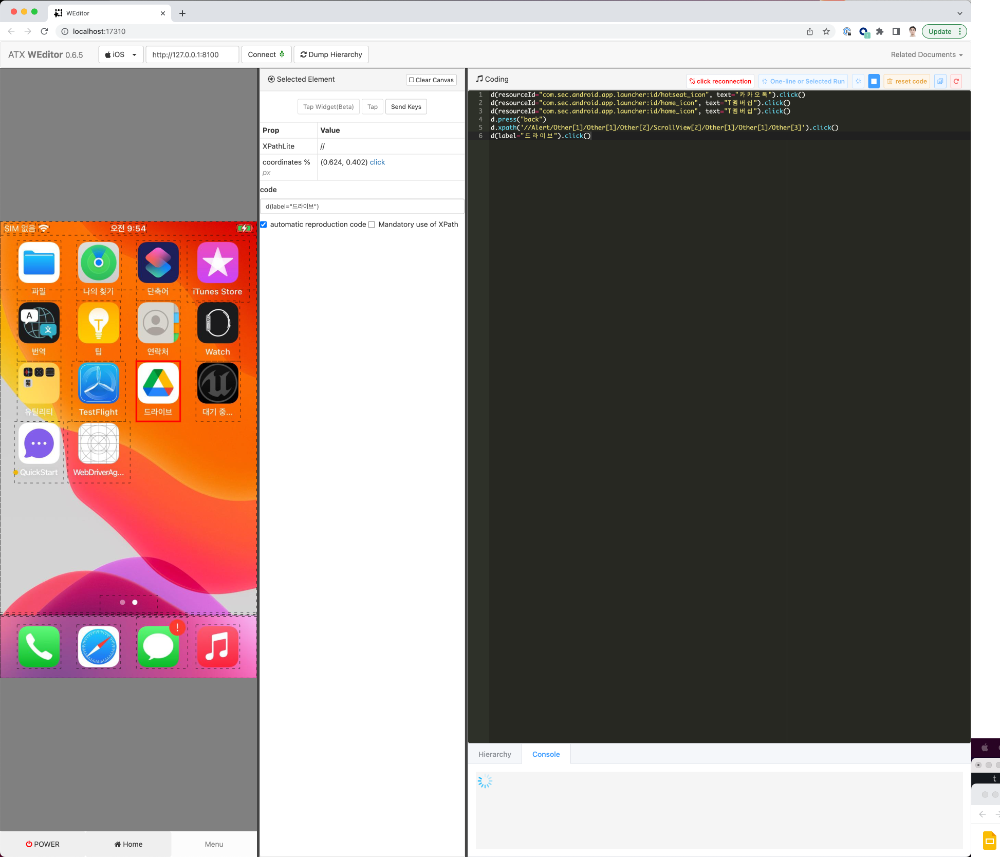

# WEditor

This project is subproject for smart phone test framework [openatx](https://github.com/openatx)
for easily use web browser to edit UI scripts.

Screenshot



## Installation
Dependencies

- Python3.6+
  - [uiautomator2](https://github.com/openatx/uiautomator2)
  - [facebook-wda](https://github.com/openatx/facebook-wda)

> Only tested in `Google Chrome`, _IE_ seems not working well.

```
git clone https://github.com/sf-luke-cha/web-editor.git
cd web-editor
python3 setup.py install
```

## Usage
run in command line

```
weditor
```

This command will start a local server with port 17310,
and then open a browser tab for you to editor you code.

Port 17310 is to memorize the created day -- 2017/03/10

To see more usage run `weditor -h`

## Hotkeys(Both Mac and Win)
- Right click screen: `Dump Hierarchy`

### Hotkeys(only Mac)
- Command+Enter: Run the whole code
- Command+Shift+Enter: Run selected code or current line if not selected

### Hotkeys(only Win)
- Ctrl+Enter: Run the whole code
- Ctrl+Shift+Enter: Run selected code or current line if not selected

## For Developers
See [DEVELOP.md](DEVELOP.md)

## LICENSE
[MIT](LICENSE)
